# Práctica 1

## Diagrama Entidad-Relación
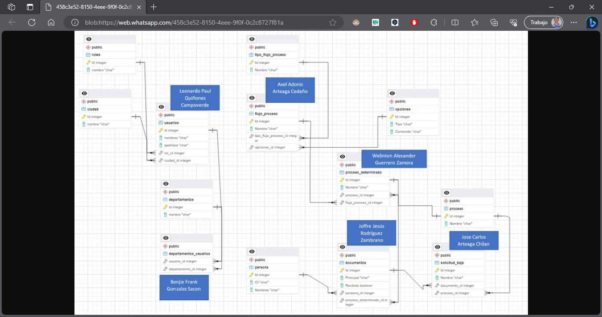
En esta sección, presentamos el diagrama entidad-relación que sirve como la representación visual de la estructura de datos que utilizamos en nuestro proyecto.

## Base de Datos
Utilizamos una base de datos NoSQL, específicamente MongoDB, para almacenar y gestionar nuestros datos. Esta elección se basa en las necesidades específicas de nuestro sistema y la flexibilidad que ofrece MongoDB en términos de almacenamiento de datos no estructurados.

## Estructura del Backend
El backend de nuestra aplicación se desarrolló utilizando el framework NestJS. Este framework de Node.js proporciona una estructura organizada y modular para construir aplicaciones web robustas y escalables. A continuación, se muestra una vista general de la estructura del backend:

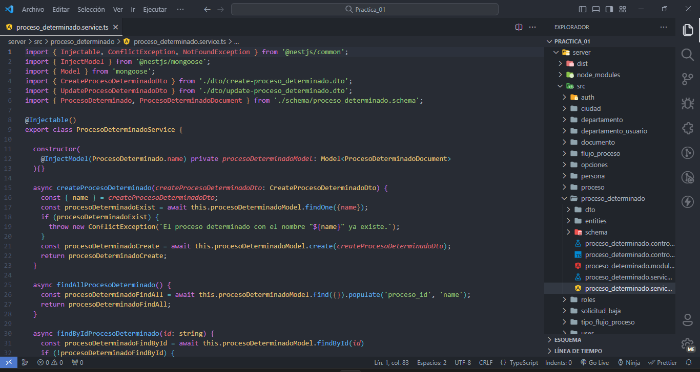

## Estructura del Frontend

El frontend se construyó con el framework Angular y muestra visualizaciones de datos obtenidos a través de nuestra API REST utilizando el método GET en las siguientes rutas:

1. **Usuarios** 🧑‍💼  
   En esta sección, mostramos datos relacionados con los usuarios de nuestro sistema.

   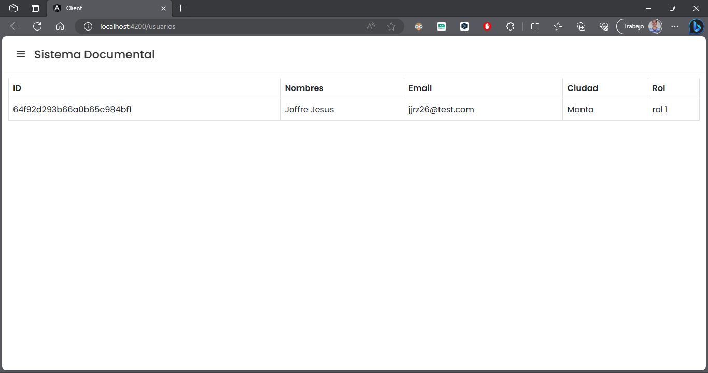

2. **Documentos** 📄  
   Aquí, puedes ver información sobre los documentos almacenados en nuestra aplicación.

   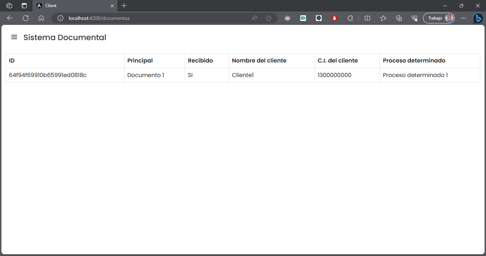

3. **Departamentos** 🏢  
   Esta visualización presenta datos relacionados con los departamentos de la organización.

   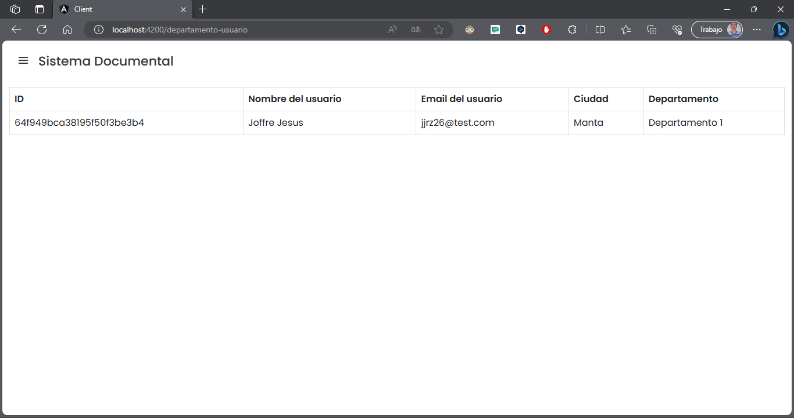

4. **Flujo de Procesos** 🔄  
   Ofrecemos una representación visual del flujo de procesos en nuestra aplicación.

   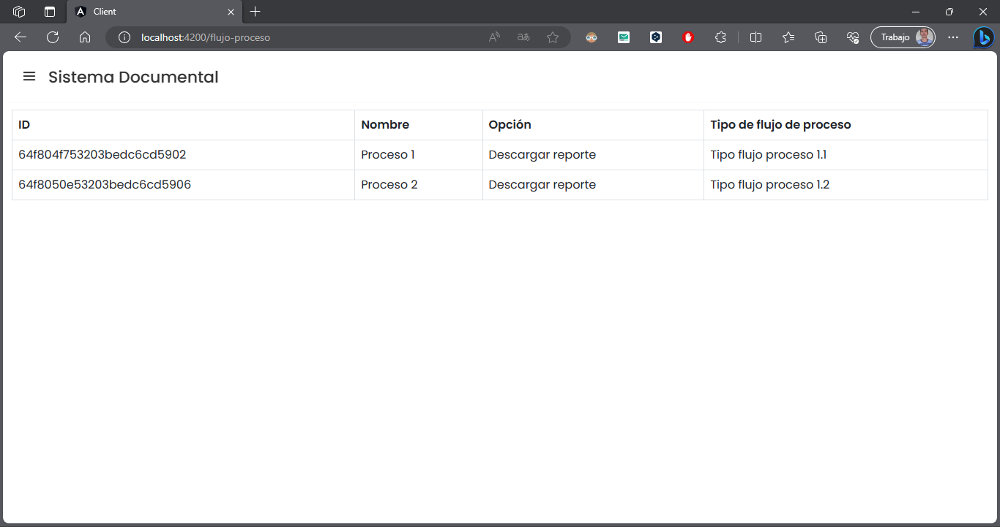

5. **Procesos Determinados** 📋  
   En esta sección, se detallan los procesos determinados que forman parte de nuestro sistema.

   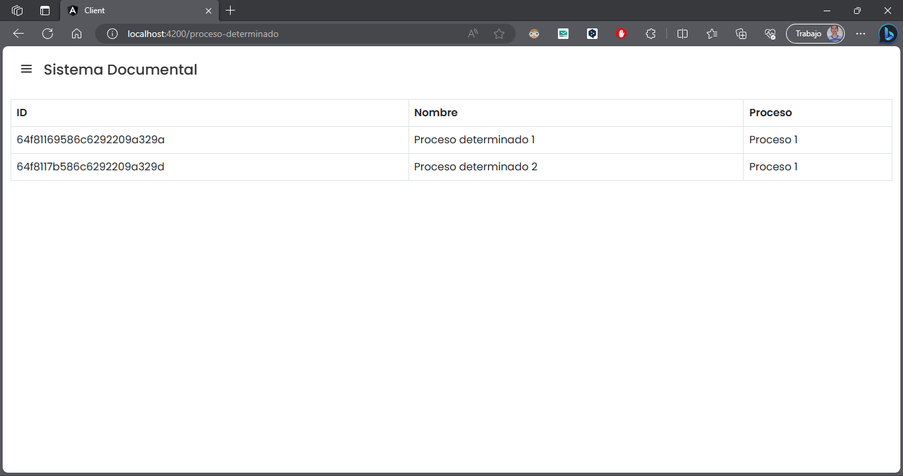

6. **Solicitud de Baja** 📉  
   Aquí, se presentan datos relacionados con las solicitudes de baja en nuestra organización.

   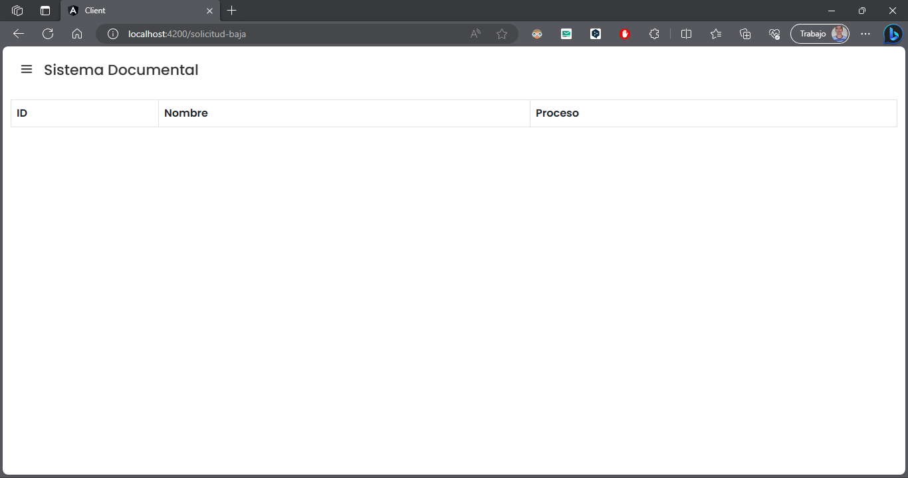

## Configuración del Docker

El proceso de dockerización se realiza de la siguiente manera:

1. Después de haber creado ambos Dockerfiles, uno para el servidor (server) y otro para el cliente (client), en nuestro archivo docker-compose, debemos configurar los servicios respectivos que necesitamos. Esto incluye la creación de las imágenes tanto para el servidor como para el cliente, para lo cual se utilizan los Dockerfiles correspondientes.

2. También debemos configurar nuestra base de datos MongoDB, ya que la utilizaremos en este entorno.

3. Luego, ejecutamos el siguiente comando para iniciar el proceso de construcción y ejecución de los contenedores:

```bash
docker-compose up --build
```


Esto nos generará las imágenes respectivas y las utilizará en el contenedor correspondiente que acabamos de crear:

- **Imágenes**:

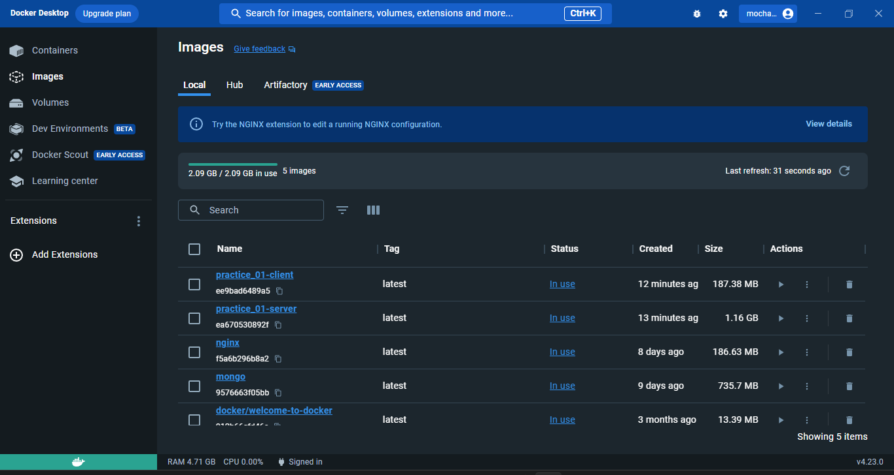

- **Contenedor**:

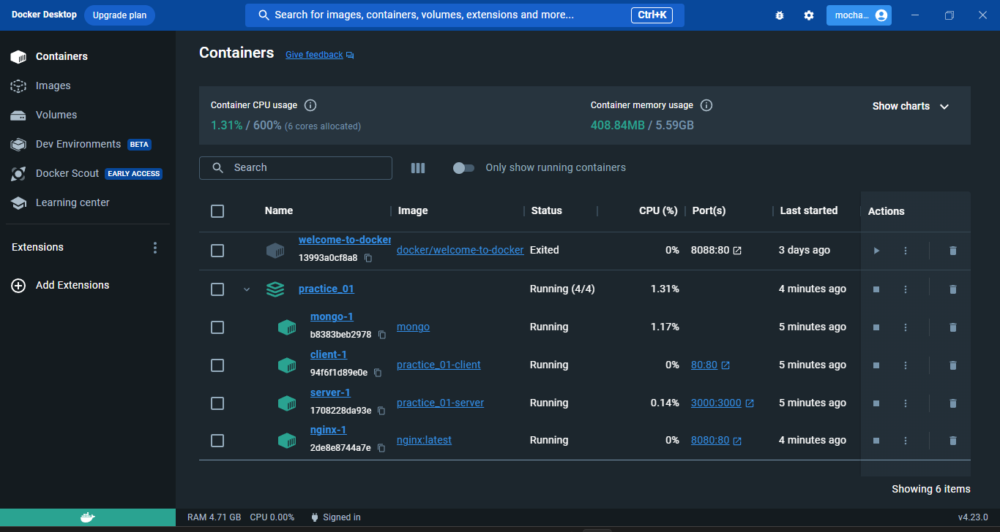

A continuación, comprobamos que, simplemente al ejecutar este proceso, podemos utilizar tanto el frontend como el backend:

- **Backend**:
   
   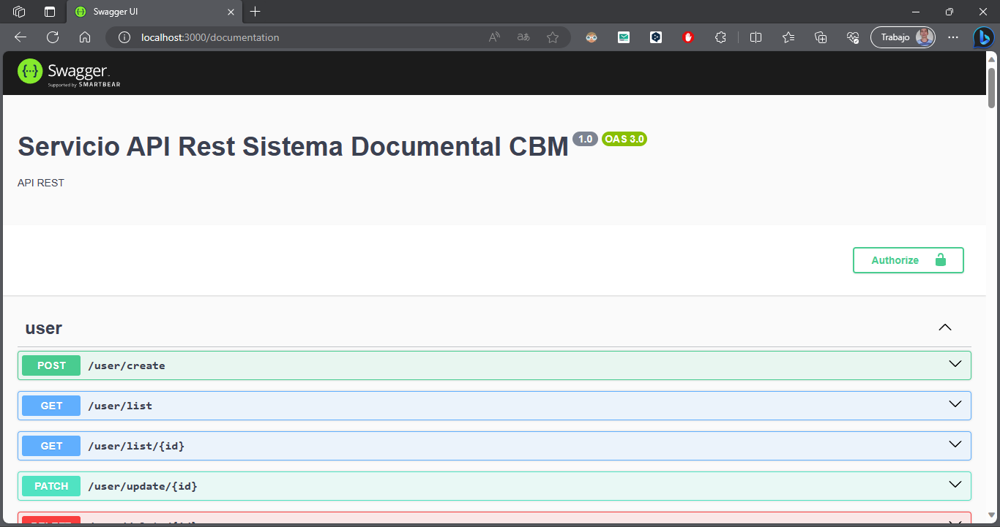

- **Frontend**:
   
   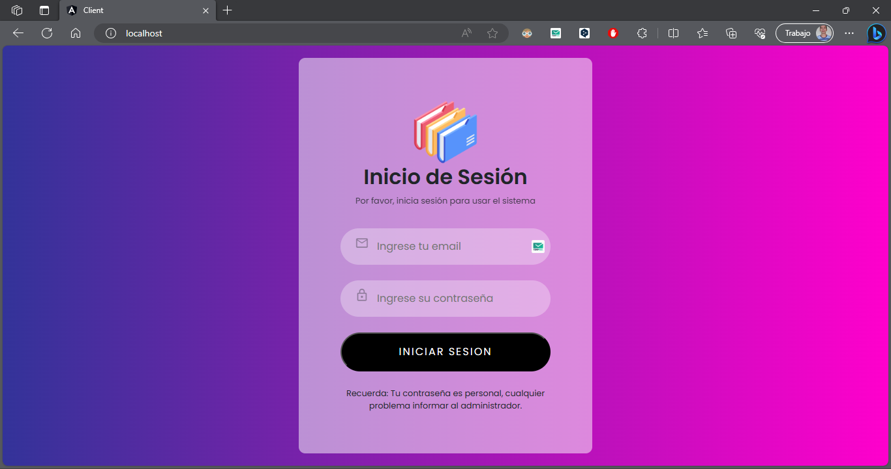