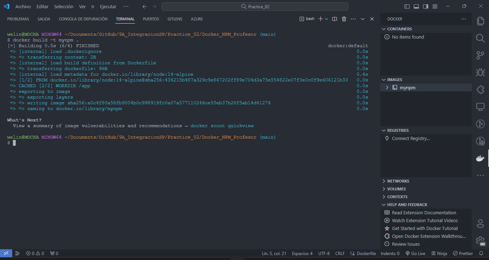

# Práctica 2

## Instrucciones

1. <span style="color: green;">**Aplicar ejemplo codificado en carpeta NPM.**</span>

    - **Puede probar los dockers de manera aislada utilizando los comandos:**
    
        Construir la imagen Docker desde la carpeta NPM:
        ```bash
        docker build -t mynpm .
        ```
        

        Iniciar un contenedor Docker interactivo y montar un directorio local en la carpeta de la aplicación:
        ```bash
        docker run -it -v [local folder]:/app mynpm init
        ```
        

        Instalar el paquete Express en la aplicación dentro del contenedor:
        ```bash
        docker run -it -v [local folder]:/app mynpm install express --save
        ```
        

    - **También puede realizar la prueba con el Docker Compose que expone los Dockers:**
    
        Inicializar la aplicación usando Docker Compose:
        ```bash
        docker-compose run npm init
        ```
        

        Inicializar la aplicación y eliminar el contenedor después de la ejecución:
        ```bash
        docker-compose run --rm npm init
        ```
        

        Instalar las dependencias de la aplicación utilizando Docker Compose:
        ```bash
        docker-compose run --rm npm install
        ```
        

        Eliminar contenedores Docker no utilizados:
        ```bash
        docker container prune
        ```
        

2. <span style="color: green;">**Probar ejemplo en carpeta Laravel.**</span>

    - **Puede considerar los siguientes pasos:**
    
        Con el docker compose definido puede crear un nuevo Proyecto en Laravel.
        ```bash
        docker-compose run --rm composer create-project --prefer-dist laravel/laravel .
        ```
        

        Al levanter el docker compose podemos tener nuestro servidor de Laravel en el puerto 8000.
        ```bash
        docker-compose up -d --build server
         ```
        
        

        Ahora podremos aplicar la herramienta migrate base de datos utilizando artisan. Antes de ejecutar el commando debemos actualizar las variables de entorno:
        
        ```bash
        docker-compose run --rm artisan migrate
        ```
        
        De este modo podríamos aplicar cuarquier método disponible en Artisan
        ```bash
        docker-compose run --rm artisan list
        ```
        

        También Podemos utilizar NPM y sus comandos
        ```bash
        docker-compose run --rm npm version
        ```
        
    
    - **Cambiar alguna vista y probar que el servidor replica los cambios revisando en el navegador.**
        
        Antes de la modificación
        

        Después de la modificación
        