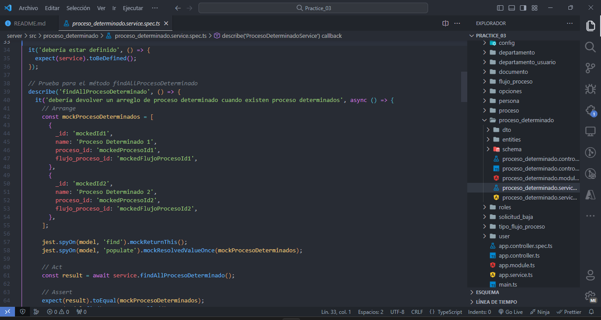

# Práctica 3

## Diagrama Entidad-Relación

En esta sección, presentamos el diagrama entidad-relación que sirve como la representación visual de la estructura de datos que utilizamos en nuestro proyecto.

## Instrucciones
1. **Aplicar servicio REST (aplicar por lo menos 2 métodos del CRUD) basado en la entidad transaccional asignada en su trabajo autónomo.**
    
    

    

2. **Aplicar por lo menos una prueba unitaria para los métodos del servicio REST.**
    
    

    

    

3. **Definir un TAG que permita dockerizar tanto el servicio REST como sus pruebas en un solo stage (se aplica compilación normal de la imágen).**

    **NOTA:** Como se acordo en clases se omitio el punto 3 y se hizo directamente el punto 4 donde se observan 4 stages en un dockerfile, con la modificacion que en el run del test solo se coloca la entidad que se representa.

4. **Crear otro TAG que permita llevar multistage con por lo menos 3 etapas sobre el mismo servicio REST.**
    
    
    ```bash
    docker build --target test -t nestjstest .
    ```
    

5. **Subir ambos TAGs a Docker Hub como versiones de la misma imagen.**
    
    
    ```bash
    docker image tag nestjstest mochasplit/isp_practice03:test
    ```
    ```bash
    docker push mochasplit/isp_practice03:test
    ```
    
    ```bash
    docker build --tag mochasplit/isp_practice03:nestjsserver .
    ```
    ```bash
    docker push mochasplit/isp_practice03:nestjsserver
    ```
    

6. **Probar localmente la descarga y funcionamiento de dicha imagen publicada con anterioridad.**
    ```bash
    docker container run mochasplit/isp_practice03:nestjsserver
    ```
    

    

7. **Aplicar patrón AAA en el desarrollo de sus pruebas.**
    
    