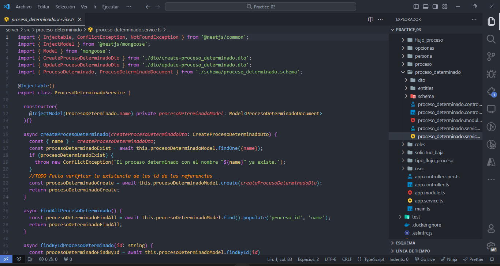
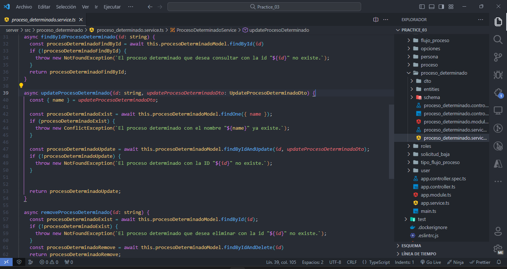
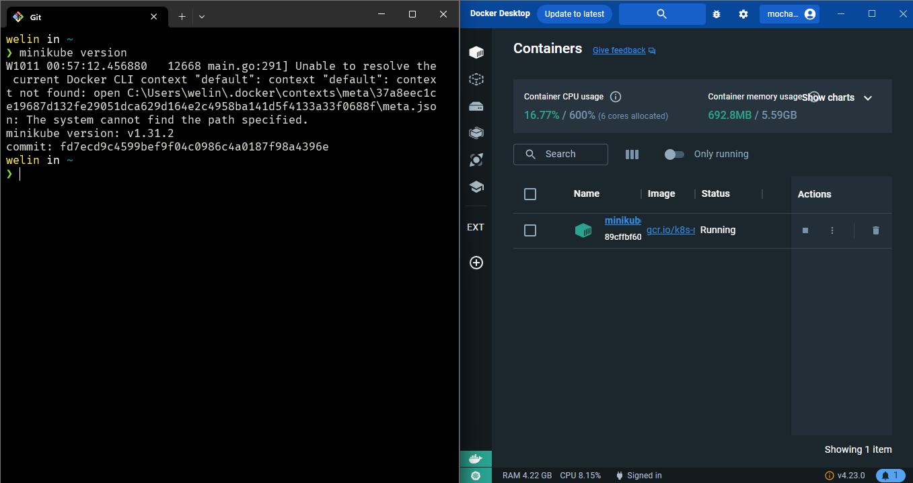
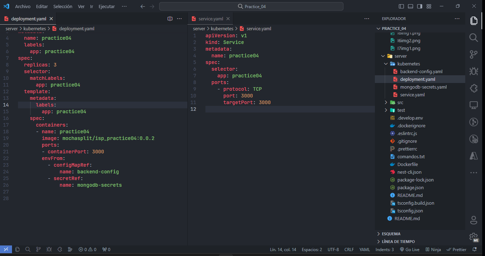
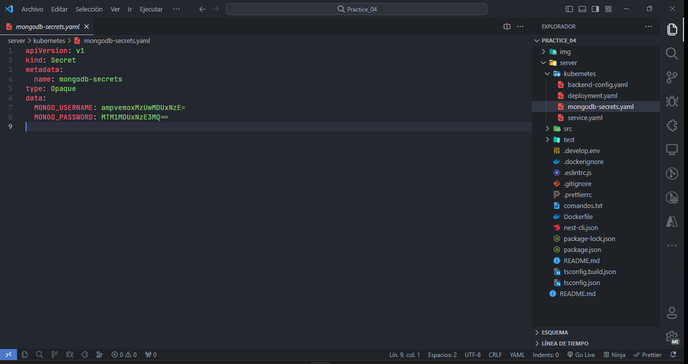
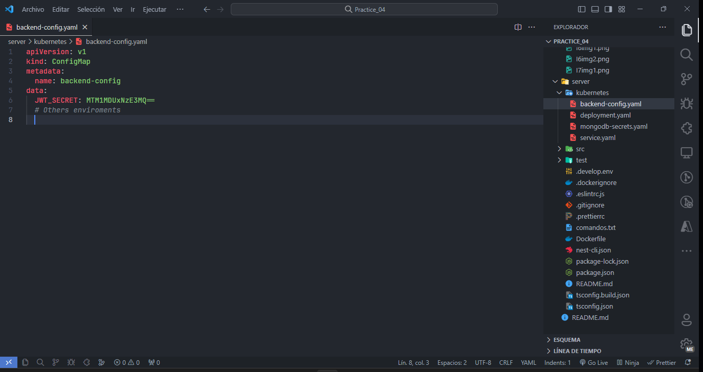
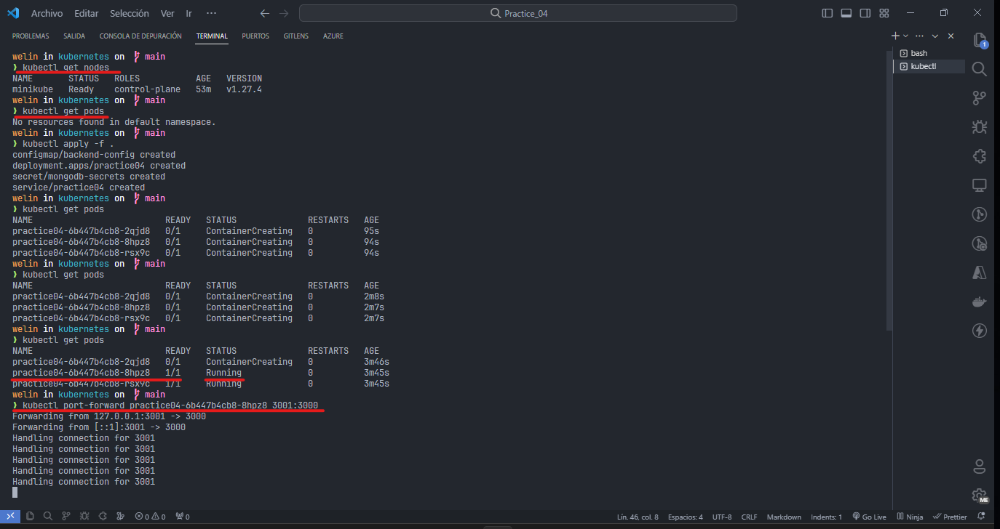
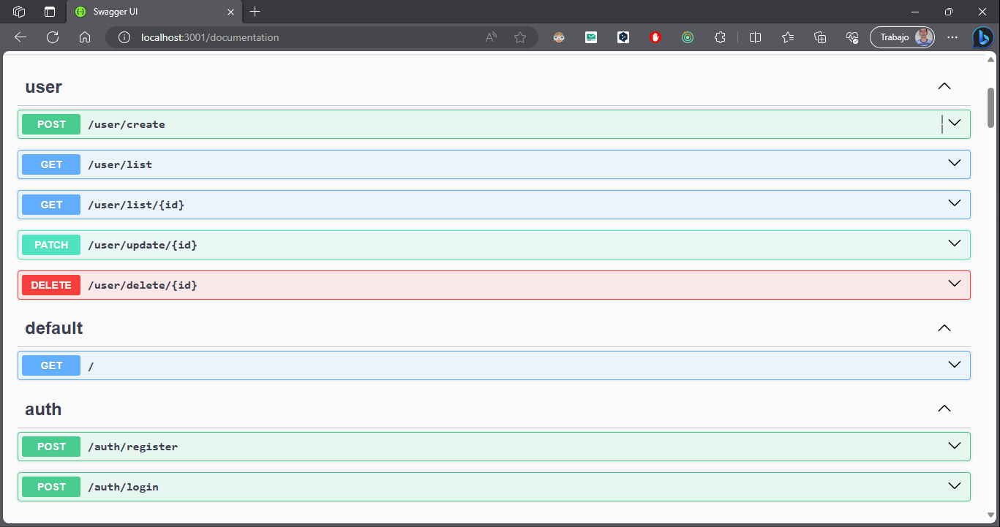
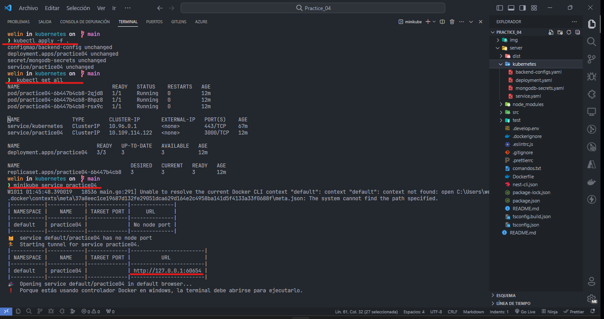

# Práctica 4

## Instrucciones
1. **Aplicar servicio REST (aplicar por lo menos 2 métodos del CRUD basado en la entidad transaccional asignada en su trabajo autónomo**
    
    

    

2. **Instalar minikube sobre Docker https://minikube.sigs.k8s.io/docs/start/**
    
    

3. **Definir configuraciones y secretos para los parámetros de su base de datos y servicio REST..**

    **NOTA:** Se realizo un solo Deployment y Service para levantar el servicio REST, ya que, la base de datos esta hosteada en mongo Atlas, sin embargo se utilizaron secrets para las base de datos y configmap para los enviroments del backend.

    


4. **Definir el Deployment y el Service para levantar su base de datos.**

    **NOTA:** Archivo secrets para las base de datos.
    
    

5. **Definir el Deployment y el Service para levantar su servicio REST.**
    
     **NOTA:** Archivo configmap para las variables de entorno del backend.

    


6. **Aplicar los siguientes comandos para aplicar su configuración con minikube.**
    
    Muestra una lista de nodos disponibles en el clúster de Kubernetes. Esto permite verificar si los nodos están en funcionamiento y disponibles para desplegar aplicaciones.
    ```bash
    kubectl get nodes
    ```
    Aplica la configuración definida en archivos YAML en el directorio actual. Usualmente, se utilizan archivos YAML para definir recursos de Kubernetes, como pods, servicios y secretos.
    ```bash
    kubectl apply -f .
    ```
    Lista todos los pods en el clúster de Kubernetes. Los pods son la unidad más pequeña de despliegue en Kubernetes y contienen una o más aplicaciones.
    ```bash
    kubectl get pods
    ```
    Establece un reenvío de puertos desde el puerto local 3001 hacia el puerto 3000 del pod con el nombre especificado. Esto permite acceder a la aplicación que se ejecuta en el pod desde tu máquina local.
    ```bash
    kubectl port-forward <nombre-del-pod> 3001:3000
    ```

    

    


    Muestra una lista de todos los recursos en el clúster, incluyendo pods, servicios, despliegues y otros objetos de Kubernetes.
    ```bash
    kubectl get all
    ```
    Abre el servicio llamado "practice04" en tu navegador web. Minikube proporciona un comando para acceder a los servicios expuestos en el clúster de Kubernetes desde tu máquina local.
    ```bash
    minikube service practice04
    ```
    Este comando crea un reenvío de puertos que permite redirigir el tráfico desde el puerto 3001 de tu máquina local hacia el puerto 3000 de un servicio llamado "practice04" en el clúster de Kubernetes. 
    ```bash
    kubectl port-forward service/practice04 3001:3000
    ```
    

    
    
