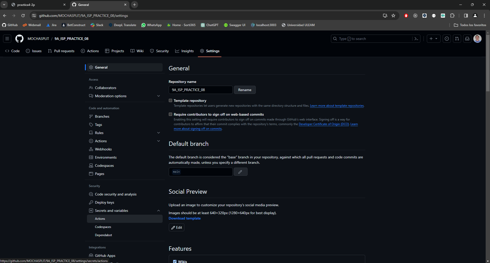

# Práctica 8

## Diagrama Entidad-Relación

En esta sección, presentamos el diagrama entidad-relación que sirve como la representación visual de la estructura de datos que utilizamos en nuestro proyecto.

## Deploy en Dockers aplicando Github Actions.

1. Crear repositorio público o privado (En el ejemplo se crea público para que todos tengan acceso al mismo).

   **URL:** https://github.com/MOCHASPLIT/9A_ISP_PRACTICE_08

   

   **NOTA:** De presentar el código Fuente publicado en su repositorio omitir pasos 2 y 3.

2. Seguir los siguientes pasos para preparar su Código y así subirlo al repositorio.
   
   • ``Git init``

   • ``Git add .``

   • ``Git commit -m “Comentarios de este primer commit”``

3. Copiar los siguiente commandos a la terminal y ejecutar para así subir su Código al repositorio
   
   • ``git remote add origin https://github.com/[usuario]/[repositorio].git``
   
   • ``git branch -M main``
   
   • ``git push -u origin main``

4. Crear los Secrets Docker_User y Docker_Password en la Plataforma GITHUB

   

5.  Utilizar su usuario y clave (token) de Docker Hub para llenar estos secrets

6. Crear Token en Docker (con el nombre Github-Actions) para que pueda ser utilizada en GitHub.

   

   

7. Copiar este Token generado en el Secret Docker_Password.

   

8. Crear Action tipo Docker Image para que se genere el Workflow.

   

9. Dockerizar nuestra aplicación (De preferencia Servicio REST o GraphQL sin dependencias).

   

10. Adicionalmente debemos constatar que la imagen puede ser compilada con ``docker build -t [CuentaDockerHub]/isp_practice08:0.0.1 .`` y probar su funcionamiento.
   
      
   **NOTA:** Podemos revisar las dependencias en el marketplace de Github para crear o modificar los pasos del archivo docker-image.yml.

11. Comprobación.
   
      

      

      

      
      
      

